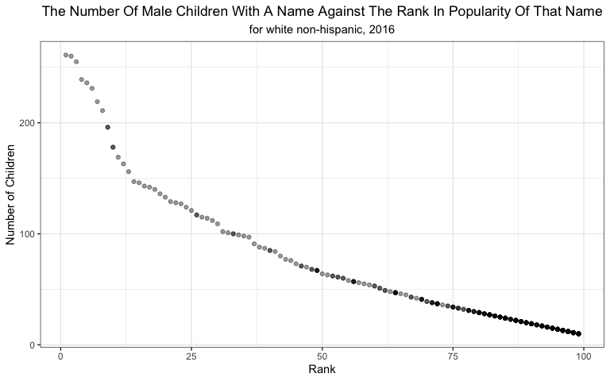

p8105\_hw2\_zl2860
================
Zongchao Liu
9/25/2019

# Problem 1

## Step 1: Read and clean the Mr. Trash Wheel sheet

``` r
trash_wheel <- read_excel("./dataset/Trash-Wheel-Collection-Totals-8-6-19.xlsx", sheet = 1) %>% 
  janitor::clean_names() %>%  # adjust variable names
  drop_na(dumpster) %>%  # omit rows that do not include dumpster-specific data
  select(dumpster:homes_powered) %>% # omit non-data columns containing notes
  mutate(sports_balls = as.integer(round(sports_balls))) # round values & convert data type
```

## Step 2: Read and clean the precipitation data for 2018 sheet

``` r
# clean the data
prec_2018 <- read_excel("./dataset/Trash-Wheel-Collection-Totals-8-6-19.xlsx", sheet = 5, skip = 1) %>%
  janitor::clean_names() %>%
  drop_na(month,total) %>%
  mutate(year = 2018)
```

## Step 3: Read and clean the precipitation data for 2017 sheet

``` r
#clean the data
prec_2017 <- read_excel("./dataset/Trash-Wheel-Collection-Totals-8-6-19.xlsx", sheet = 6, skip = 1) %>%
  janitor::clean_names() %>%
    drop_na(month,total) %>%
    mutate(year = 2017)
```

## Step 4: Combine precipitation datasets and convert month to a character variable

``` r
# combine data 
prec_17_18 <- bind_rows(prec_2017,prec_2018) %>%
  select(month, year, total) %>% # arrange the order of the columns
  mutate(month = month.name[month]) 
```

### Data Interpretation

The `trash_wheel` dataset includes general information on the dumpster
number, date of collection, amount of total litter, litter type and the
number of homes that are powered by collecting and processing trash. The
`trash_wheel` dataset has 344 observations of 14 variables and the
`prec_17_18` dataset with precipitation data in 2017 and 2018 has 24
observations of 3 variables. For the `trash_wheel` dataset, key
variables are `weight_tons, volume_cubic_yards, plastic_bottles,
polystyrene, cigarette_butts, glass_bottles, grocery_bags, chip_bags,
sports_balls, homes_powered`. These variables contain the most core
information that should be taken into account for analysis when
researchers raise a specific question. In contrast, variables like
`dumpster, month, year, date` do not contain very specific information
like litter type or litter volume but serve as important roles for
indexing and grouping data. When researchers put forward a question like
" Is there any difference of the total litter weights among different
years?", indexing and grouping in the dataset become necessary.
Therefore, these variables are also important and cannot be dropped
without any consideration. For the `combined_17_18` dataset, the
principle is similar. The key variable is `total`. The `year` and
`month` variables do not indicate the amount of trash or other
information but serve as unique index for each total value.

The total precipitation in 2018 was 70.33 and the median number of
sports balls in a dumpster in 2017 was 8.

# Promblem 2

## Step 1: Clean the data in “pols-month.csv”

``` r
pols_month <- read_csv("./dataset/pols-month.csv") %>%
  separate(mon,
           c("year", "month", "day"),
           remove = TRUE) %>%
  mutate(month = month.abb[as.numeric(month)],
         president = ifelse(prez_dem == "0","gop","dem")) %>%  
  # Here if the the value of `prez_dem` is 2, we still treat it as 1
  select(-day, -prez_dem, -prez_gop)
```

## Step 2: Clean the data in “snp.csv”

``` r
snp <- read_csv("./dataset/snp.csv") %>%
  separate(date,
           c("month","day","year")) %>%
  select(year,month,everything(),-day) %>%
  mutate(month = month.abb[as.numeric(month)])
```

## Step 3: Tidy the unemployment data

``` r
unemployment <- read_csv("./dataset/unemployment.csv") %>%
  pivot_longer( Jan:Dec,
                names_to = "month",
                values_to = "percentage"
  ) %>%
  janitor::clean_names() %>%  # clean names only after the month names become values
  mutate( year = as.character(year)) %>%
  select( year, month, everything()) %>%
  drop_na(percentage) # drop missing values
```

The percentage is the key variable of the unemployment dataset. I
dropped these rows with missing values of this variable before merging
data.

## Step 4: Join the datasets

``` r
merged_problem2 <- left_join(left_join(pols_month,snp),unemployment)
```

    ## Joining, by = c("year", "month")
    ## Joining, by = c("year", "month")

``` r
# merge datasets
```

## Data Interpretation

The `pols_month` dataset has 822 observations of 9 variables and
includes the information on the number of national
politicians(Governors, Senators and Representatives) who are democratic
or republican in each month of the associate year (from 1947 to 2015).

The `snp` dataset has 787 observations of 3 variables and includes the
information on the closing values of the S\&P stock index on the
associated date.

The `unemployment` dataset has 810 observations of 3 varaibles and
includes information on percentage of unemployment in each month of the
associated year(from 1948 to 2015).

The dimension of the resulting dataset `merged_problem2` is (822,
11)(822 rows, 11 columns). The range of years is from 1947 to 2015. Key
variables in this dataset are `gov_gop, sen_gop, rep_gop, gov_dem,
sen_dem, rep_dem, president, close, percentage`, which together show an
overview of the political and economic situations in the United States.

# Problem 3

## Step 1: Load and tidy the data

``` r
Popular_Baby_Names <- read_csv("./dataset/Popular_Baby_Names.csv") %>%
  janitor::clean_names() %>%
  mutate(gender = str_to_lower(gender),
         ethnicity = str_to_lower(recode(ethnicity,
                            "ASIAN AND PACI" = "ASIAN AND PACIFIC ISLANDER",
                            "BLACK NON HISP" = "BLACK NON HISPANIC" ,
                            "WHITE NON HISP" = "WHITE NON HISPANIC"
                            )),
         childs_first_name = str_to_title(childs_first_name)) %>%
  distinct() # remove duplicated rows
```

## Step 2: Make a table showing the rank in popularity of the name “Olivia” as a female baby name over time

``` r
#The table shows the rank in popularity of the name “Olivia” as a female baby name over time
changes_of_Olivia <- Popular_Baby_Names %>%
  filter(childs_first_name == "Olivia") %>%
  select(ethnicity, rank, year_of_birth) %>%
  pivot_wider(names_from = year_of_birth,
              values_from = rank) %>%
  knitr::kable(caption = paste("Table 2. ",
                               str_to_title("the rank in popularity of the name Olivia from 2011 to 2016")
                               )
               )
changes_of_Olivia
```

| ethnicity                  | 2016 | 2015 | 2014 | 2013 | 2012 | 2011 |
| :------------------------- | ---: | ---: | ---: | ---: | ---: | ---: |
| asian and pacific islander |    1 |    1 |    1 |    3 |    3 |    4 |
| black non hispanic         |    8 |    4 |    8 |    6 |    8 |   10 |
| hispanic                   |   13 |   16 |   16 |   22 |   22 |   18 |
| white non hispanic         |    1 |    1 |    1 |    1 |    4 |    2 |

Table 2. The Rank In Popularity Of The Name Olivia From 2011 To
2016

## Step 3: Make a table showing the most popular name among male children over time

``` r
# the similar table shows the most popular name among male children over time  
male_rank <- Popular_Baby_Names %>%
  filter(gender == "male") %>%
  group_by(ethnicity) %>%
  filter(rank == min(rank)) %>%
  select(ethnicity, year_of_birth, childs_first_name) %>%
  pivot_wider(names_from = year_of_birth ,
              values_from = childs_first_name) %>%
  knitr::kable(caption=paste("Table 1. ",
                              str_to_title("the most popular name among male children from 2011 to 2016")
                              )
               )
male_rank
```

| ethnicity                  | 2016   | 2015   | 2014   | 2013   | 2012   | 2011    |
| :------------------------- | :----- | :----- | :----- | :----- | :----- | :------ |
| asian and pacific islander | Ethan  | Jayden | Jayden | Jayden | Ryan   | Ethan   |
| black non hispanic         | Noah   | Noah   | Ethan  | Ethan  | Jayden | Jayden  |
| hispanic                   | Liam   | Liam   | Liam   | Jayden | Jayden | Jayden  |
| white non hispanic         | Joseph | David  | Joseph | David  | Joseph | Michael |

Table 1. The Most Popular Name Among Male Children From 2011 To 2016

## Step 4: Make a scatter plot

``` r
# create the dataframe for plotting
male_white_NH_2016 <- Popular_Baby_Names %>%
  filter(gender == "male",
         ethnicity == "white non hispanic",
         year_of_birth == 2016)

#use ggplot2 to make a scatter plot
male_white_NH_2016 %>%
  ggplot(aes(x= rank, y = count)) + 
  geom_point(alpha = .4) + 
  labs(x="Rank",y="Number of Children", 
                    title = str_to_title("The Number of Male Children with a Name Against the Rank in Popularity of That Name"),
                    subtitle = "for white non-hispanic, 2016" ) +
  theme_bw() +
  theme(plot.title = element_text(hjust = 0.5),
        plot.subtitle =element_text(hjust = 0.5) )
```

<!-- -->
